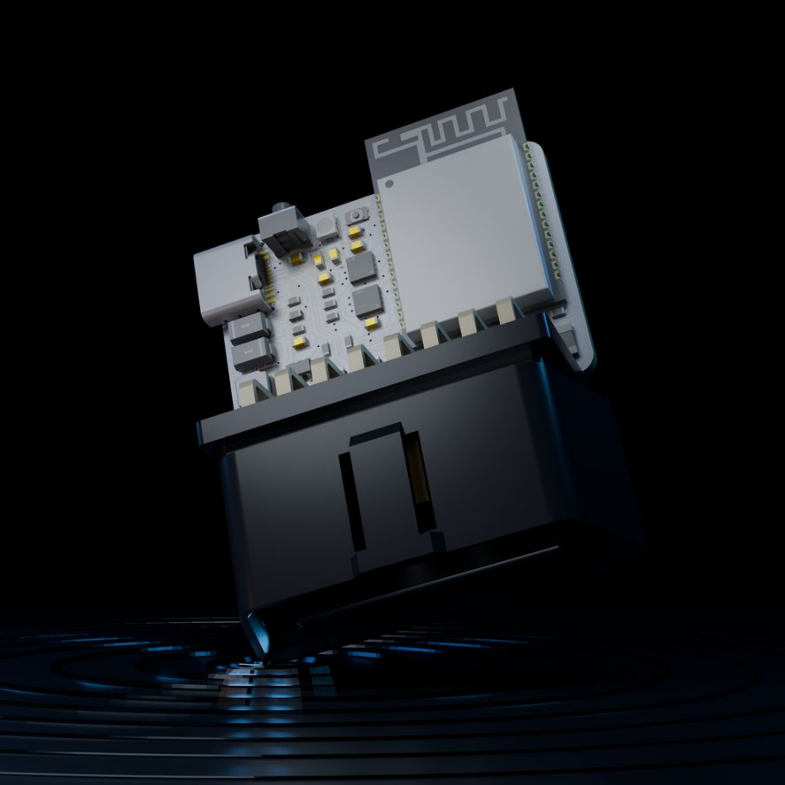

# CANOpener SE

CAN Opener Standard Edition, Hardware Revision A.

CANOpener SE is a compact dual CAN bus interface that plugs into a vehicle OBD-II diagnostic port. It is built around an Espressif ESP32-C5 with two independent CAN-FD controllers and two Texas Instruments TCAN3414 transceivers.

## Documentation

- [Hardware specifications](docs/hardware.md)
- [Original hardware PDF](docs/CANOpener-SE-Hardware-Revision-A.pdf)

## Highlights

|                   |                               |
| ----------------- | ----------------------------- |
| MCU               | Espressif ESP32-C5            |
| CAN transceivers  | 2× Texas Instruments TCAN3414 |
| Interfaces        | 2× Classical CAN / CAN FD     |
| Max CAN data rate | 5 Mbps                        |
| Vehicle input     | Up to 24 V (typical 12 V)     |
| USB               | USB-C, 5 V                    |
| Logic             | 3.3 V                         |
