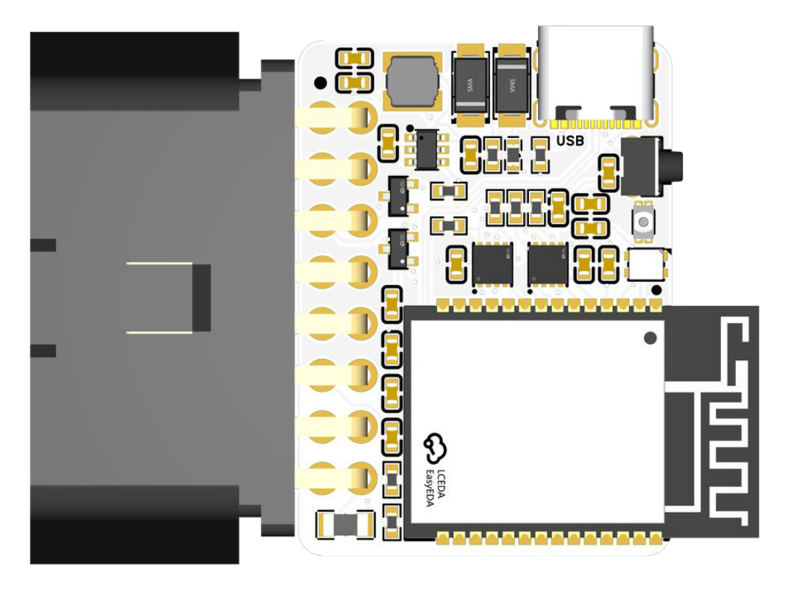
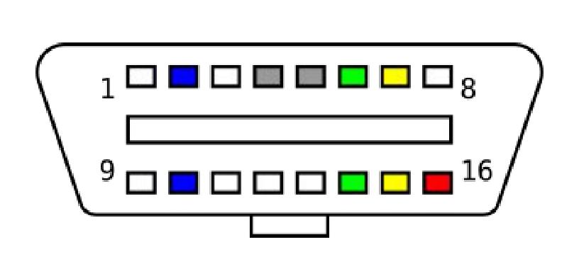
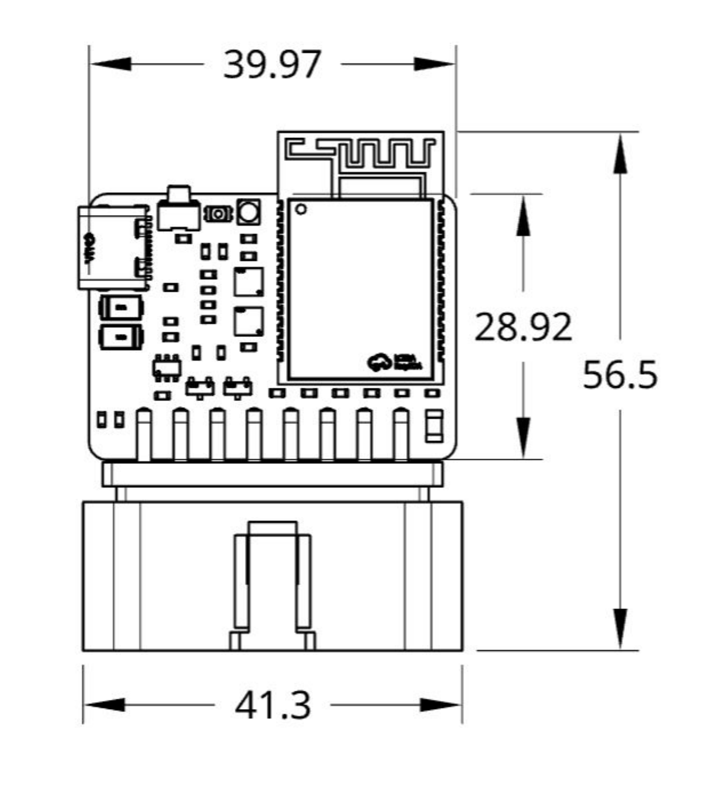

# CANOpener SE Hardware Specifications

Standard Edition · Hardware Revision A

Original document: [CANOpener-SE-Hardware-Revision-A.pdf](CANOpener-SE-Hardware-Revision-A.pdf)

## Introduction

CANOpener SE is a compact dual CAN bus interface designed to connect directly to vehicle networks through the OBD-II diagnostic port.

At the heart of CANOpener SE is an Espressif ESP32-C5 microcontroller with two independent CAN-FD controllers and integrated wireless connectivity. Two Texas Instruments TCAN3414 CAN transceivers provide the physical interface between the controller and the vehicle CAN networks.

The device connects directly to two CAN buses available through the OBD-II connector and supports both Classical CAN and CAN FD communication. CANOpener SE can be powered directly from the vehicle or through USB-C for development and configuration.

Onboard voltage regulation, input protection, CAN bus protection, an addressable RGB status LED, and dedicated Boot and Reset controls are integrated into the board.

## Electrical specifications

| Specification | Value |
| --- | --- |
| Vehicle input voltage | Up to 24 V |
| Typical input voltage | 12 V |
| USB input voltage | 5 V |
| Logic / I/O voltage | 3.3 V |
| Operating current | — |
| CAN interfaces | 2 |
| CAN protocols | Classical CAN, CAN FD |
| Maximum CAN data rate | 5 Mbps |

## Hardware overview

### OBD-II pinout

| Pin | Signal | Pin | Signal |
| ---: | --- | ---: | --- |
| 1 | NC | 9 | NC |
| 2 | NC | 10 | NC |
| 3 | CAN1 High | 11 | CAN1 Low |
| 4 | GND | 12 | NC |
| 5 | NC | 13 | NC |
| 6 | CAN0 High | 14 | CAN0 Low |
| 7 | NC | 15 | NC |
| 8 | NC | 16 | Vehicle Power |

## Physical specifications

| Dimension | Value |
| --- | --- |
| Overall height | 56.5 mm |
| Connector width | 41.3 mm |
| PCB width | 39.97 mm |
| PCB height | 28.92 mm |
